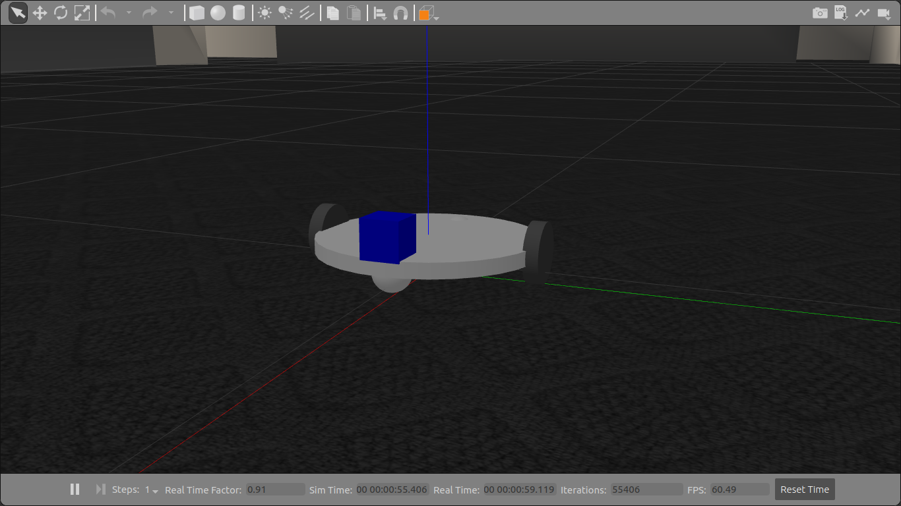
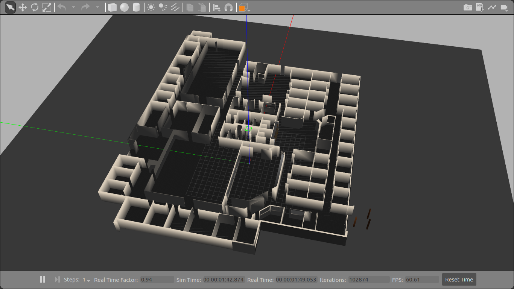
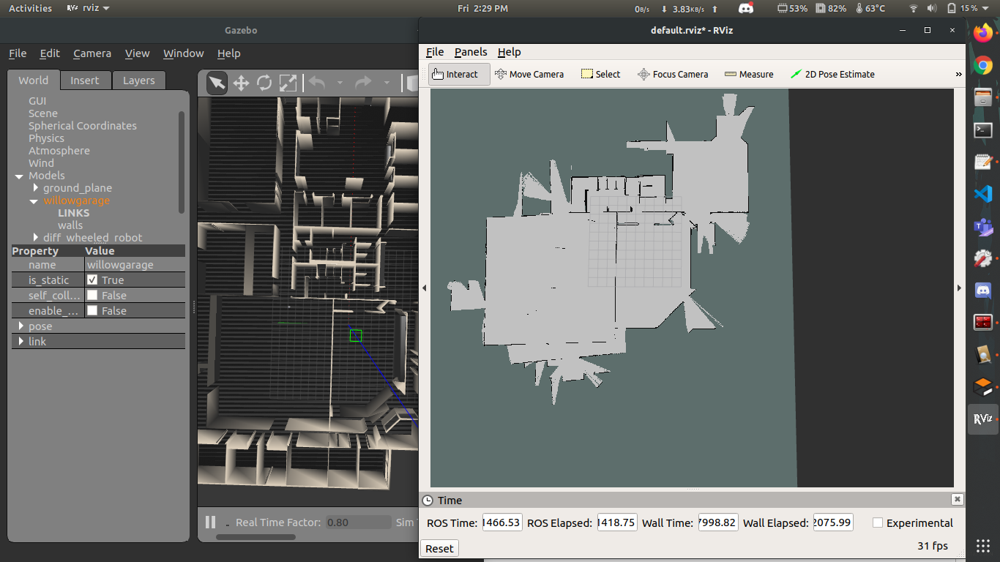

# Basic 2-D mapping using ROS

+ [gmapping](http://wiki.ros.org/gmapping) package, which provides laser-based SLAM is used for mapping.
+ A 2-wheel differential drive robot with laser scanner mounted on the top is used to map the Willow garage world.
+ The robot is controlled through keyboard using arrow keys.

## Usage:

1. Nagivate to the **src** folder of your catkin workspace and execute:

+ `$ https://github.com/harshkc03/pkg_2d_nav_robot.git`
+ `$ cd ../`
+ `$ catkin_make`

2. Run the following commands in given order in different terminals:

+ `$ roslaunch pkg_2d_nav_robot diff_wheeled_gazebo_full.launch`
  
+ `$ roslaunch pkg_2d_nav_robot gmapping.launch`
  
+ `$ roslaunch pkg_2d_nav_robot keyboard_teleop.launch`

3. Launch **RViz**:

+ `$ rviz`

+ Go to **Add** --> **By topic** --> under `/map` select **Map** and click **Ok**
+ Again, go to **Add** --> **By display type** --> **RobotModel** and click **Ok**

