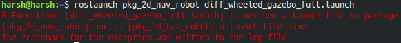

# Basic 2-D mapping using ROS

+ [gmapping](http://wiki.ros.org/gmapping) package, which provides laser-based SLAM is used for mapping.
+ A 2-wheel differential drive robot with laser scanner mounted on the top is used to map the Willow garage world.
+ The robot is controlled through keyboard using arrow keys.

## Pre-requisites installation:

+ `$ sudo apt-get install ros-melodic-navigation`

+ `$ sudo apt-get install ros-melodic-gmapping`

## Usage:

1. Nagivate to the **src** folder of your catkin workspace and execute:

+ `$ git clone https://github.com/harshkc03/pkg_2d_nav_robot.git`
+ `$ cd ../`
+ `$ catkin_make`

2. Run the following commands in given order in different terminals:

+ `$ roslaunch pkg_2d_nav_robot diff_wheeled_gazebo_full.launch`
  
+ `$ roslaunch pkg_2d_nav_robot gmapping.launch`

3. Launch **RViz**:

+ `$ rviz`

+ Go to **Add** --> **By topic** --> under `/map` select **Map** and click **Ok**
+ Again, go to **Add** --> **By display type** --> **RobotModel** and click **Ok**

4. Play with your robot !

+ `$ roslaunch pkg_2d_nav_robot keyboard_teleop.launch`

5. To save your map, execute:

+ `$ rosrun map_server map_saver -f my_map`

Here, `my_map` is the name of the save file and will be saved in your **Home** directory

**Note:** If you get an error like:

Then source your **setup.bash** file like:

+ `$ source ~/workshop/devel/setup.bash`

Or alternatively, add the above line at the end of your **.bashrc** file

